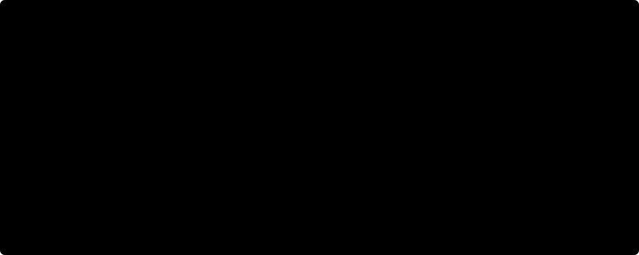
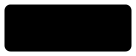
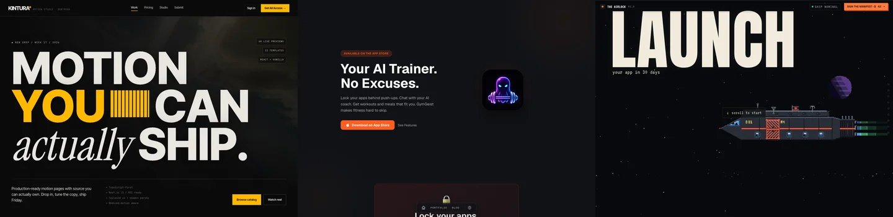

<picture>
  <source media="(max-width: 600px) and (prefers-color-scheme: dark)" srcset="./assets/neofetch-dark-mobile.svg">
  <source media="(max-width: 600px)" srcset="./assets/neofetch-light-mobile.svg">
  <source media="(prefers-color-scheme: dark)" srcset="./assets/neofetch-dark.svg">
  
</picture>

  <a href="https://freye.tech"><picture><source media="(prefers-color-scheme: dark)" srcset="./assets/button-website-dark.svg"></picture></a>
  <a href="https://twitter.com/freyedev"><picture><source media="(prefers-color-scheme: dark)" srcset="./assets/button-x-dark.svg"></picture></a>
  <a href="https://www.youtube.com/@freyedev"><picture><source media="(prefers-color-scheme: dark)" srcset="./assets/button-youtube-dark.svg"></picture></a>
  <a href="https://instagram.com/freyedev"><picture><source media="(prefers-color-scheme: dark)" srcset="./assets/button-instagram-dark.svg"></picture></a>

## Products & websites

| Project | What it does |
| :--- | :--- |
| [xmaxx](https://xmaxx.me) | Publishing, scheduling, and audience growth on X. |
| [Kintura](https://kintura.xyz) | Motion templates for React and the web. |
| [The Airlock](https://theairlock.space) | A 30-day shipping challenge with public accountability. |
| [fr3n](https://fr3n.fan) | Creator pages, communities, memberships, and digital products. |
| [GymGeist](https://freye.tech/gymgeist) | An iOS fitness coach. Unlock your apps with push-ups. |
| [Caramia](https://freye.tech/caramia) | Shared photos, memories, and plans for couples. |
| [Draht Voice](https://voice.draht.dev) | AI phone agents for trades and medical practices. |
| [Listening Eyes](https://listening-eyes.projetbetula.com) | An interactive art exhibition with a spatial map. |
| [Creavings](https://creavings.com) | A marketplace for creative workshops and experiences. |

## Open source

**[draht](https://draht.dev)** · [Source](https://github.com/draht-dev/draht) An AI coding agent with tests first and multi-model routing.

**[platine](https://github.com/draht-dev/platine)** Typed agent workflows, deployed into your own AWS account.

**[genuiform](https://genuiform.draht.dev)** · [Source](https://github.com/oskarfreye/genuiform) Flutter forms that adapt to the answers you give.

**[brain.nvim](https://github.com/oskarfreye/brain.nvim)** Daily coding challenges inside Neovim. Keep writing some of the code yourself.

**[goelectrodb](https://github.com/oskarfreye/goelectrodb)** DynamoDB single-table design in Go.

**[BlitzKeys](https://github.com/oskarfreye/blitzkeys)** Real-time multiplayer typing races, built with Elixir and Phoenix LiveView.

---

[Full portfolio](https://freye.tech/portfolio) · [TikTok](https://tiktok.com/@freyedev)
